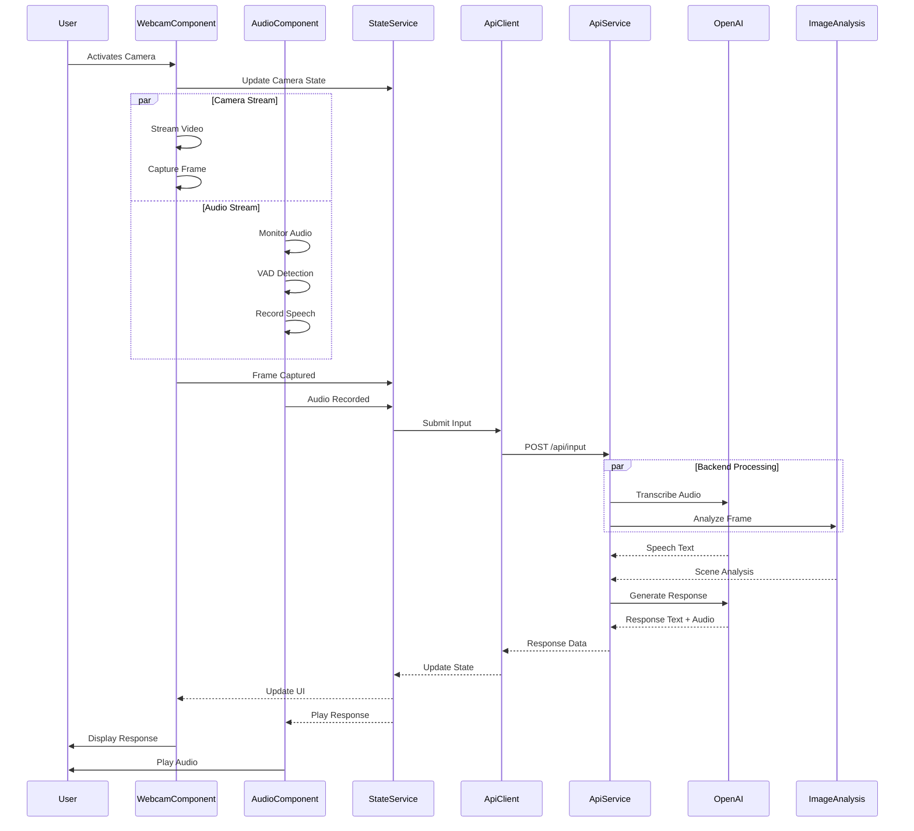
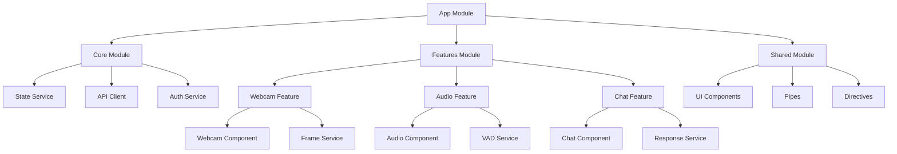

# ServoSkull

A desktop companion application that combines computer vision, speech recognition, and AI to create an interactive assistant with a Warhammer 40k personality.

## Overview

ServoSkull observes the user through their webcam and microphone, processing the input to provide context-aware, sarcastic responses in the style of a 40k servo-skull.

### Core Features

- Webcam frame capture and analysis
- Voice activity detection and processing
- AI-powered responses with character
- Text-to-speech output

## Architecture

### Component Flow



### Component Structure



### Service Responsibilities

#### Frontend Services

- **StateService**: Manages application state using RxJS
  - Camera status
  - Audio status
  - Processing states
  - Response history

- **ApiClient**: Handles API communication
  - Request/response interceptors
  - Error handling
  - File uploads
  - Response streaming

- **FrameService**: Manages webcam operations
  - Stream initialization
  - Frame capture
  - Quality settings
  - Error handling

- **VADService**: Handles voice activity
  - Audio stream management
  - Speech detection
  - Recording control
  - Buffer management

#### Backend Services

- **InputController**: Handles input processing
  - File validation
  - Request routing
  - Response formatting

- **AudioService**: Manages audio processing
  - OpenAI Whisper integration
  - Audio format conversion
  - Speech-to-text processing

- **VisionService**: Handles image analysis
  - Frame processing
  - Object detection
  - Scene analysis

- **ResponseService**: Generates responses
  - Context analysis
  - Response generation
  - Text-to-speech conversion

## Project Structure

```text
/
├── .cursor/                  # Development rules and settings
│   └── rules/               # Project-specific rules
├── assets/                  # Shared assets
│   ├── audio/              # Audio resources
│   └── images/             # Image resources
├── ServoSkull.AppHost/      # .NET Aspire Host
│   └── Program.cs          # Service orchestration
├── ServoSkull.ServiceDefaults/ # Shared service configurations
├── ServoSkull.ApiService/   # .NET Backend
│   ├── Controllers/         # API endpoints
│   ├── Services/           # Business logic
│   └── Models/             # Data models
├── ServoSkull.Angular/      # Frontend
│   ├── src/
│   │   ├── app/
│   │   │   ├── core/      # Core services
│   │   │   ├── shared/    # Shared components
│   │   │   └── features/  # Feature modules
│   │   ├── assets/        # Angular-specific assets
│   │   └── environments/  # Environment configurations
│   └── .cursor/rules/     # Angular-specific rules
└── docs/                  # Documentation
```

## Development

### Prerequisites

- .NET 9.0 SDK
- Node.js 22+ and npm
- Angular CLI 19+
- Visual Studio 2022 or VS Code
- Docker Desktop (for Aspire containers)

### Quick Start

1. Clone and setup:

   ```bash
   git clone https://github.com/mgpeter/desktop-companion.git
   cd desktop-companion
   ```

2. Setup user secrets

   ```bash
   dotnet user-secrets init
   dotnet user-secrets set "OpenAI:ApiKey" "<your-api-key>"
   ```

3. Start the Aspire host (this will start all backend services):

   ```bash
   cd ServoSkull.AppHost
   dotnet run
   ```

### Performance Considerations

1. **Audio Processing**
   - Maximum audio duration: 30 seconds
   - Supported formats: WebM, WAV
   - Recommended sample rate: 16kHz

2. **Image Processing**
   - Maximum frame size: 1920x1080
   - Recommended format: JPEG
   - Quality range: 0.7-0.9
   - Maximum frames per input: 3

3. **Response Times**
   - Audio transcription: 1-3 seconds
   - Response generation: 2-5 seconds
   - Speech synthesis: 1-2 seconds

4. **Rate Limiting**
   - Maximum 30 interactions per minute
   - Maximum 100 frames per minute
   - Maximum 5 concurrent sessions per user

## Contributing

1. Follow the development rules in `.cursor/rules/`
2. Ensure tests pass
3. Submit PRs with clear descriptions

## License

MIT License - see [LICENSE](LICENSE) file for details.
