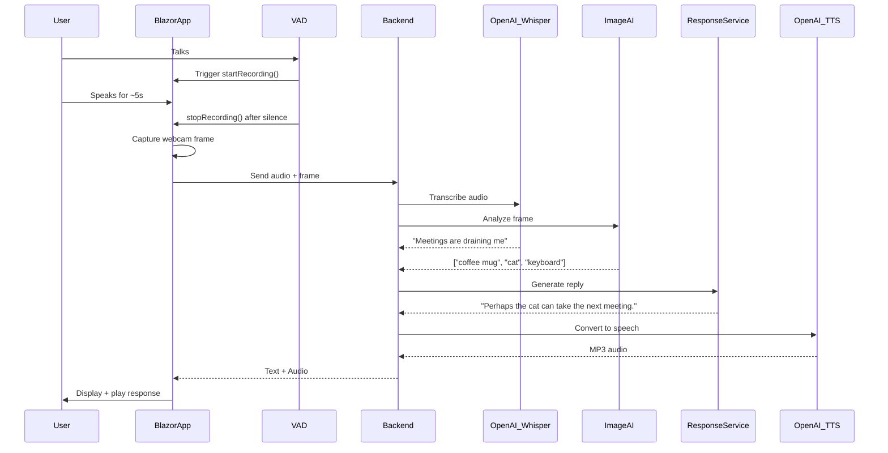

# ServoSkull.NET v1.0 – Technical Specification

## 🧠 Overview

**ServoSkull.NET** is a Blazor-based, voice-enabled AI assistant powered by .NET 9 and OpenAI's audio APIs. It continuously observes the user via webcam and microphone, using **voice activity detection (VAD)** to determine when the user is speaking.

When speech is detected and a sentence has likely ended, the app:

- Captures a short audio clip
- Captures a snapshot (or burst) of webcam frames
- Sends both to the backend

The backend:

- Transcribes the audio using OpenAI Whisper
- Analyzes the image(s)
- Generates a sarcastic response in the voice of a 40k-style servo-skull
- Converts the response to speech using OpenAI TTS
- Sends the response (text + audio) back to the frontend

---

## 🧱 Core Components

### 🖥️ Frontend – Blazor WebAssembly or Server

**Responsibilities:**

- Capture webcam feed via HTML5 video
- Detect voice activity via JS + VAD library
- Record audio only when user is speaking
- Capture webcam frame at the end of speech
- Send audio + frame(s) to backend
- Display and play assistant's response

**Key Libraries:**

- HTML5 `MediaRecorder` (audio capture)
- JS VAD library (e.g., [`vad.js`](https://github.com/jarredsumner/vad.js))
- JS `<canvas>` for frame capture
- OpenAI TTS playback (MP3 via HTMLAudioElement)

---

### ⚙️ Backend – ASP.NET Core (.NET 9)

**Responsibilities:**

- Accept audio + image payloads
- Transcribe audio using OpenAI Whisper
- Analyze image using ML.NET or external service
- Generate context-aware response
- Convert response to speech using OpenAI TTS
- Return both to frontend

**Service Modules:**

- `SpeechToTextService` → Whisper API
- `ImageAnalysisService` → ML or 3rd-party vision API
- `ResponseService` → Combines inputs + generates text
- `TextToSpeechService` → OpenAI TTS

---

## 🔁 Application Flow (with VAD)



---

## 📦 Payload Format

### Request to Backend

```json
{
  "audio": "<binary audio blob>",
  "frames": [
    "data:image/jpeg;base64,..."
  ],
  "timestamp": "2025-03-28T14:37:00Z"
}
```

---

## 📡 API Endpoints (OpenAPI-style)

### `POST /api/input`

Sends audio + frame(s) to backend for full processing.

#### Request (multipart/form-data)

- `file`: audio file (`.wav`, `.webm`, etc.)
- `frames[]`: 1+ image strings (base64 or as image files)

#### Response

```json
{
  "text": "Perhaps the cat can take the next meeting.",
  "audioUrl": "/api/audio/response/123456"
}
```

---

### `GET /api/audio/response/{id}`

Returns generated MP3 response.

**Response:**

- `Content-Type: audio/mpeg`
- MP3 binary stream

---

## 🔊 Audio Capture Logic (Frontend)

- Use VAD library to monitor audio input in real time
- Start recording on detected voice
- Stop recording when:
  - Silence ≥ 800ms
  - OR max duration reached (~10s)
- Debounce between recordings (~1s wait after send)
- Capture webcam frame right at end of utterance

---

## 🧠 GPT Prompt Guidelines

### 🔍 For Spec Awareness

> *"You are a technical assistant trained on the ServoSkull.NET spec. Use the defined architecture and component roles to guide all responses."*

---

### 🧪 For Code

> *"You are a .NET 9 and Blazor expert. Use idiomatic C# and async best practices. Match code to the architecture in the ServoSkull.NET spec."*

---

### 🦾 For Personality

> *"You are a cheeky, sarcastic, dramatic servo-skull from the Imperium. Your tone is clever, theatrical, and often condescending—but in a helpful way. Channel 40k flair in every reply."*

**Examples:**

- "Another sigh. Another meeting. Another cry for the sweet release of bolter fire."
- "Your screen is as empty as your inbox after a productivity sprint."

---

### 🎙️ For OpenAI TTS

| Parameter       | Value                                        |
|-----------------|----------------------------------------------|
| Endpoint        | `/v1/audio/speech`                           |
| Voice           | `onyx` (or custom fine-tuned voice)          |
| Output format   | `mp3`                                        |
| Prompt style    | Slightly British, smug, dramatic, sarcastic  |

**Prompt Template:**
> "Using a slightly British, sarcastic, smug servo-skull voice, say the following aloud:  
> {generatedText}"

---

## ✅ MVP Feature Checklist

- [ ] VAD system using 3rd-party JS lib
- [ ] Audio recording triggered by voice
- [ ] Webcam frame capture on utterance end
- [ ] Backend handling of audio + frames
- [ ] OpenAI Whisper integration (STT)
- [ ] Image analysis integration (ML.NET or API)
- [ ] Response generation logic
- [ ] OpenAI TTS response (MP3)
- [ ] UI chat log + audio playback

---

## 🧩 Future Enhancements

- Facial emotion detection
- Object tracking with multiple frame comparison
- Role modes: Techpriest / Commissar / Medicae
- Physical skull hardware mount + servo control
- Custom voice cloning or ElevenLabs integration

---

Let me know if you want this exported as a `.md` file, dropped into a README template, or split into smaller doc sections (API spec, architecture guide, GPT prompt library, etc.). Or shall we begin planning the **backend interfaces** next?

# ServoSkull

A desktop companion application that combines the power of .NET, Blazor, and Angular to create an intelligent assistant with computer vision capabilities.

## Project Structure

The project is split into multiple components:

```
ServoSkull/
├── ServoSkull.Web/           # Blazor WebAssembly host application
│   ├── Components/           # Blazor components
│   ├── Services/             # Backend services
│   └── wwwroot/             # Static web assets
├── ServoSkull.Angular/       # Angular frontend application
│   ├── src/
│   │   ├── app/
│   │   │   ├── core/        # Core services and guards
│   │   │   ├── shared/      # Shared components and utilities
│   │   │   └── features/    # Feature modules (webcam, analysis, etc.)
│   │   ├── assets/          # Static assets
│   │   └── environments/    # Environment configurations
│   └── .cursor/rules/       # Cursor development rules
└── docs/                    # Documentation
```

## Architecture

The application follows a hybrid architecture:

1. **Blazor WebAssembly Host**
   - Serves as the main application host
   - Handles WebAssembly initialization
   - Manages API routing and services

2. **Angular Frontend**
   - Modern, responsive user interface
   - Feature-based module organization
   - State management with NgRx
   - Lazy-loaded modules for optimal performance

3. **Integration Layer**
   - WebAPI endpoints for Angular-Blazor communication
   - Shared DTOs for type safety
   - SignalR for real-time updates

## Features

- **Webcam Integration**
  - Real-time video capture
  - Frame analysis and processing
  - ML.NET integration for object detection

- **User Interface**
  - Modern Angular Material design
  - Responsive layout
  - Accessibility compliant
  - Dark/Light theme support

- **Performance**
  - Lazy loading of features
  - Optimized asset delivery
  - Client-side caching
  - WebAssembly acceleration

## Development Setup

### Prerequisites

- .NET 8.0 SDK
- Node.js 18+ and npm
- Angular CLI 17+
- Visual Studio 2022 or VS Code

### Getting Started

1. Clone the repository:
   ```bash
   git clone https://github.com/yourusername/servoskull.git
   ```

2. Start the Blazor host:
   ```bash
   cd ServoSkull.Web
   dotnet run
   ```

3. Start the Angular development server:
   ```bash
   cd ServoSkull.Angular
   npm install
   ng serve
   ```

4. Open your browser to:
   - Blazor Host: `https://localhost:5001`
   - Angular Dev Server: `http://localhost:4200`

### Development Rules

The project follows strict development guidelines:

- Angular development rules are in `.cursor/rules/frontend-angular-ui.mdc`
- Blazor component rules are in `.cursor/rules/frontend-ui.mdc`
- Git commit rules are in `.cursor/rules/git-commits.mdc`

## Testing

- Run Angular tests:
  ```bash
  cd ServoSkull.Angular
  ng test
  ```

- Run Blazor tests:
  ```bash
  cd ServoSkull.Web
  dotnet test
  ```

## Contributing

1. Follow the development rules in `.cursor/rules/`
2. Ensure tests pass
3. Submit PRs with clear descriptions

## License

This project is licensed under the MIT License - see the LICENSE file for details.
