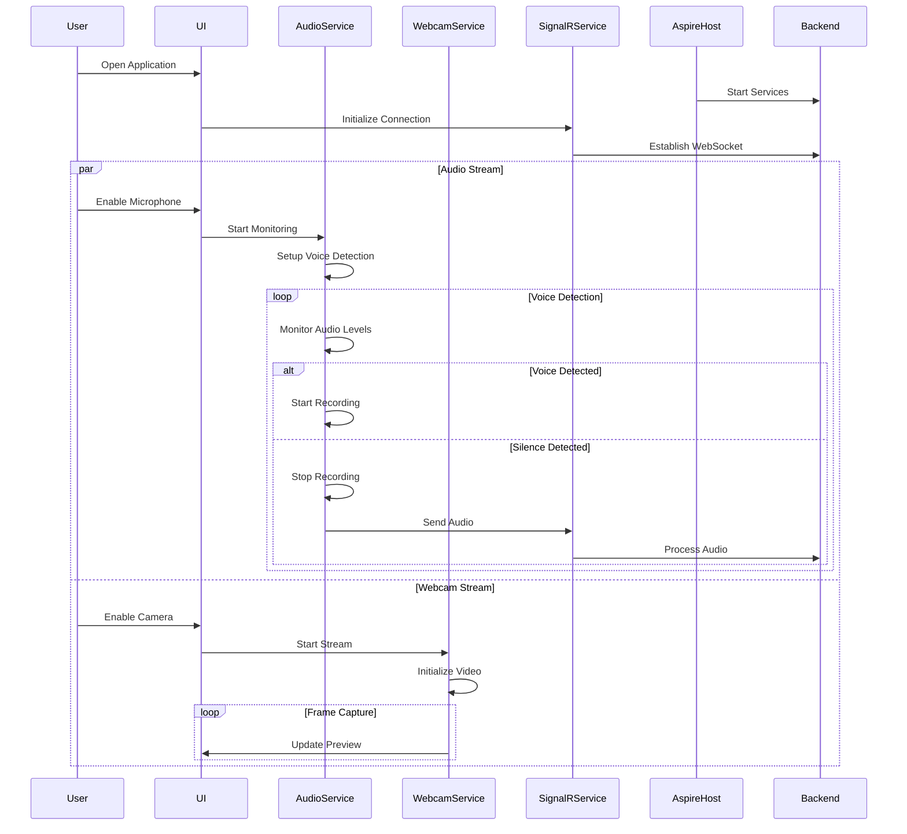
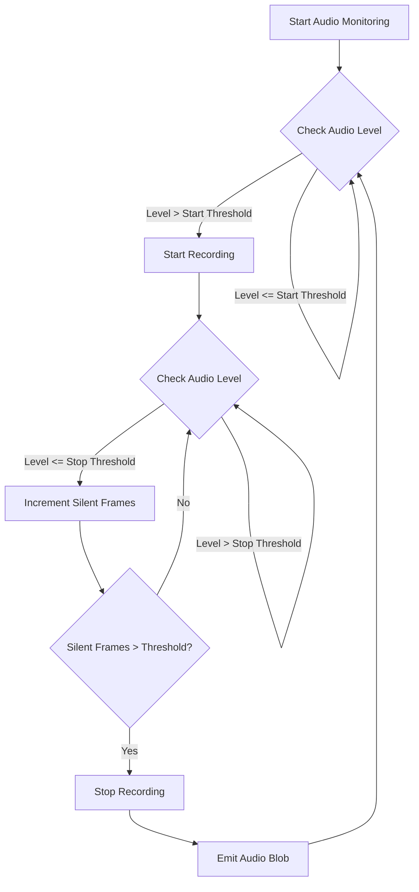
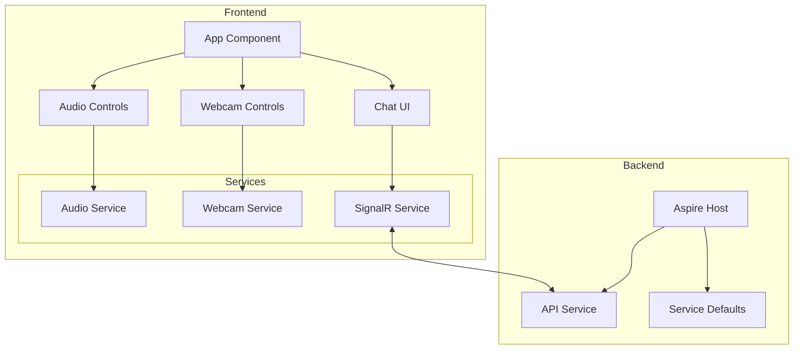
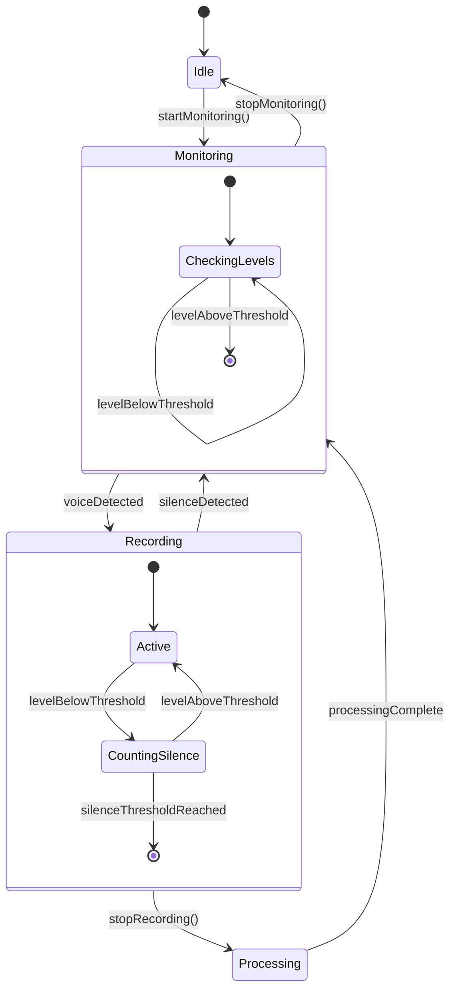
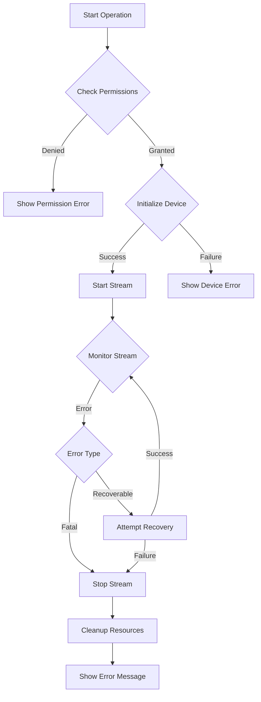

# ServoSkull 🤖

**An AI-Powered Multimodal Desktop Companion**

*Showcasing the future of human-AI interaction through voice, vision, and intelligent conversation*

---

**ServoSkull** is a cutting-edge AI desktop companion that demonstrates the potential of multimodal AI agents. Built by **Usual Expat Limited**, this project explores advanced AI interaction capabilities through seamless integration of voice recognition, computer vision, and natural language processing.

> 🚀 **Future Vision**: ServoSkull is designed with robotics integration in mind - imagine an AI that can see, hear, speak, and eventually control servo motors to move and interact with the physical world based on conversation and visual input.

## ✨ Key Features

### 🎤 Voice-Activated AI Interaction
- **Smart Voice Detection**: Advanced silence detection with configurable thresholds
- **Real-time Processing**: Instant voice-to-text using OpenAI Whisper
- **Natural Conversations**: Context-aware responses with conversation history
- **Text-to-Speech**: High-quality AI voice responses

### 👁️ Computer Vision Integration  
- **Live Camera Feed**: Real-time webcam integration with frame capture
- **Visual Context**: AI analyzes images sent with each message
- **Multi-resolution Support**: Adaptive camera resolution handling
- **Privacy-First**: Local processing with secure cleanup

### 🧠 Advanced AI Capabilities
- **Multimodal Processing**: Combines text, audio, and visual inputs
- **OpenAI Integration**: GPT models, Whisper transcription, and TTS
- **Session Management**: Persistent conversation context
- **Real-time Communication**: SignalR-based instant messaging

### ⚡ Modern Architecture
- **Microservices**: .NET Aspire orchestration for scalability
- **Reactive Frontend**: Angular 19 with RxJS state management  
- **Production Ready**: Docker containerization and monitoring
- **Developer Experience**: Hot reload, comprehensive logging, and debugging tools

## 🚀 Quick Start

### Prerequisites

- **.NET 9.0 SDK** (for Aspire and backend services)
- **Node.js v22+** (for Angular frontend)
- **Modern Browser** with WebRTC support (Chrome/Edge recommended)
- **OpenAI API Key** (for AI functionality)

### System Requirements

| Component | Minimum | Recommended |
|-----------|---------|-------------|
| RAM | 8GB | 16GB+ |
| CPU | 4 cores | 8 cores+ |
| Storage | 2GB | 5GB+ |
| Browser | Chrome 90+ | Chrome/Edge Latest |

### Installation & Setup

**1. Clone and Navigate**
```bash
git clone <repository-url>
cd desktop-companion
```

**2. Configure OpenAI API**
```bash
cd ServoSkull.ApiService
dotnet user-secrets init
dotnet user-secrets set "OpenAI:ApiKey" "<your-api-key-here>"
cd ..
```

**3. Install Dependencies**
```bash
# Install Angular dependencies
cd ServoSkull.Angular
npm install
cd ..

# Install Tailwind CLI globally (optional)
npm install -g @tailwindcss/cli
```

**4. Start the Application**
```bash
# Start all services with Aspire orchestration
dotnet run --project ServoSkull.AppHost
```

**5. Access the Application**
- **Aspire Dashboard**: `http://localhost:18888` (service monitoring)
- **Angular App**: `http://localhost:4200` (main interface)
- **API Service**: `http://localhost:5000` (backend API)

## .NET Aspire Integration

The application uses .NET Aspire for cloud-ready distributed application development and orchestration.

### App Host Structure

```text
ServoSkull.AppHost/              # Aspire host application
├── Program.cs                   # Service orchestration
└── appsettings.json            # Host configuration

ServoSkull.ServiceDefaults/      # Shared service configurations
├── Extensions.cs               # Service collection extensions
└── OpenTelemetry.cs           # Telemetry configuration

ServoSkull.ApiService/          # Backend API service
└── Program.cs                 # API service entry point
```

### Development Workflow

1. **Start the Aspire Host**:

   ```bash
   dotnet run --project ServoSkull.AppHost
   ```

   This will:
   - Start the Aspire dashboard
   - Launch the API service
   - Configure service discovery
   - Initialize telemetry collection

2. **Access the Dashboard**:
   - Open the dashboard URL in your browser
   - Monitor service health
   - View logs and telemetry
   - Check service dependencies

3. **Development Mode**:

   ```bash
   # Run with hot reload
   dotnet watch run --project ServoSkull.AppHost
   
   # Run with detailed logging
   dotnet run --project ServoSkull.AppHost --verbose
   ```

### Production Deployment

For production deployment, Aspire provides:

- Container orchestration
- Environment-specific configurations
- Health check endpoints
- Metrics collection
- Distributed tracing

Configure production settings in `appsettings.Production.json`:

```json
{
  "Aspire": {
    "Telemetry": {
      "Endpoint": "your-telemetry-endpoint",
      "Protocol": "grpc"
    },
    "Resilience": {
      "CircuitBreaker": {
        "SamplingDuration": "00:00:10"
      }
    }
  }
}
```

### Monitoring and Debugging

- Access the Aspire dashboard for:
  - Service status and health
  - Log aggregation
  - Performance metrics
  - Dependency mapping
  - Configuration validation

- Integrated logging with structured data:

  ```csharp
  logger.LogInformation("Service {ServiceName} started", serviceName);
  ```

- Health check endpoints:

  ```bash
  curl http://localhost:18888/health
  ```

## System design

### Frontend Services

- `AudioService`: Handles voice detection and recording
- `WebcamService`: Manages webcam streams
- Both services follow Angular's dependency injection pattern

### State Management

- Uses RxJS BehaviorSubjects for state management
- Provides Observable streams for reactive updates
- Maintains clean separation of concerns

### Error Handling

- Comprehensive error handling for media devices
- Detailed logging for debugging
- User-friendly error messages

### Diagrams


```mermaid
sequenceDiagram
    participant User
    participant UI
    participant AudioService
    participant WebcamService
    participant SignalRService
    participant AspireHost
    participant Backend

    User->>UI: Open Application
    AspireHost->>Backend: Start Services
    UI->>SignalRService: Initialize Connection
    SignalRService->>Backend: Establish WebSocket

    par Audio Stream
        User->>UI: Enable Microphone
        UI->>AudioService: Start Monitoring
        AudioService->>AudioService: Setup Voice Detection
        loop Voice Detection
            AudioService->>AudioService: Monitor Audio Levels
            alt Voice Detected
                AudioService->>AudioService: Start Recording
            else Silence Detected
                AudioService->>AudioService: Stop Recording
                AudioService->>SignalRService: Send Audio
                SignalRService->>Backend: Process Audio
            end
        end
    and Webcam Stream
        User->>UI: Enable Camera
        UI->>WebcamService: Start Stream
        WebcamService->>WebcamService: Initialize Video
        loop Frame Capture
            WebcamService->>UI: Update Preview
        end
    end
```


```mermaid
flowchart TD
    A[Start Audio Monitoring] --> B{Check Audio Level}
    B -->|Level > Start Threshold| C[Start Recording]
    B -->|Level <= Start Threshold| B
    C --> D{Check Audio Level}
    D -->|Level > Stop Threshold| D
    D -->|Level <= Stop Threshold| E[Increment Silent Frames]
    E --> F{Silent Frames > Threshold?}
    F -->|No| D
    F -->|Yes| G[Stop Recording]
    G --> H[Emit Audio Blob]
    H --> B
```


```mermaid
graph TD
    subgraph Frontend
        A[App Component]
        B[Audio Controls]
        C[Webcam Controls]
        D[Chat UI]
        
        subgraph Services
            E[Audio Service]
            F[Webcam Service]
            G[SignalR Service]
        end
        
        A --> B & C & D
        B --> E
        C --> F
        D --> G
    end
    
    subgraph Backend
        H[Aspire Host]
        I[API Service]
        J[Service Defaults]
        
        H --> I
        H --> J
    end
    
    G <--> I
```


```mermaid
stateDiagram-v2
    [*] --> Idle
    Idle --> Monitoring: startMonitoring()
    Monitoring --> Recording: voiceDetected
    Recording --> Monitoring: silenceDetected
    Recording --> Processing: stopRecording()
    Processing --> Monitoring: processingComplete
    Monitoring --> Idle: stopMonitoring()
    
    state Monitoring {
        [*] --> CheckingLevels
        CheckingLevels --> CheckingLevels: levelBelowThreshold
        CheckingLevels --> [*]: levelAboveThreshold
    }
    
    state Recording {
        [*] --> Active
        Active --> CountingSilence: levelBelowThreshold
        CountingSilence --> Active: levelAboveThreshold
        CountingSilence --> [*]: silenceThresholdReached
    }
```


```mermaid
flowchart TD
    A[Start Operation] --> B{Check Permissions}
    B -->|Denied| C[Show Permission Error]
    B -->|Granted| D{Initialize Device}
    D -->|Success| E[Start Stream]
    D -->|Failure| F[Show Device Error]
    E --> G{Monitor Stream}
    G -->|Error| H{Error Type}
    H -->|Recoverable| I[Attempt Recovery]
    H -->|Fatal| J[Stop Stream]
    I -->|Success| G
    I -->|Failure| J
    J --> K[Cleanup Resources]
    K --> L[Show Error Message]
```

## Browser API Integration

### Camera Integration

The application uses the WebRTC API to access the user's camera through the `WebcamService`. Here's how it works:

1. **Stream Initialization**:

   ```typescript
   const stream = await navigator.mediaDevices.getUserMedia({
     video: {
       width: { ideal: 640 },
       height: { ideal: 480 },
       facingMode: 'user'
     }
   });
   ```

2. **Frame Capture**:
   - Primary method uses the modern `ImageCapture` API:

     ```typescript
     const imageCapture = new ImageCapture(videoTrack);
     const blob = await imageCapture.takePhoto();
     ```

   - Fallback to Canvas API if `ImageCapture` is not supported:

     ```typescript
     const canvas = document.createElement('canvas');
     const ctx = canvas.getContext('2d');
     ctx.drawImage(videoElement, 0, 0);
     const dataUrl = canvas.toDataURL('image/png');
     ```

3. **Resource Management**:
   - Proper cleanup of video tracks when stopping the stream
   - Automatic resource release when component is destroyed
   - Server-side rendering (SSR) safety checks

### Audio Recording and Playback

The application uses the Web Audio API and MediaRecorder API for sophisticated audio handling through the `AudioService`. The service integrates with SignalR for real-time communication and provides reactive state management:

1. **Audio Configuration**:

   ```typescript
   interface AudioConfig {
     sampleRate: number;      // Audio sampling rate
     channels: number;        // Number of audio channels
     startThreshold: number;  // Volume threshold to start recording
     stopThreshold: number;   // Lower threshold to maintain recording
     silenceThreshold: number;  // Time in ms to consider silence
     smoothingTimeConstant: number; // Smoothing factor for analysis
   }

   // Default configuration
   const defaultConfig = {
     sampleRate: 16000,      // 16kHz for optimal speech
     channels: 1,            // Mono audio
     startThreshold: 0.24,   // Start at 24% volume
     stopThreshold: 0.15,    // Keep recording until 15%
     silenceThreshold: 2000, // Stop after 2s silence
     smoothingTimeConstant: 0.8
   };
   ```

2. **State Management**:

   ```typescript
   interface AudioMonitorState {
     isMonitoring: boolean;    // Audio analysis active
     isRecording: boolean;     // Currently recording
     voiceDetected: boolean;   // Voice detected
     audioLevel: number;       // Current volume (0-1)
   }

   interface AudioPlaybackState {
     isPlaying: boolean;
     duration: number;
     currentTime: number;
   }

   // Service provides observables for state
   audioService.monitorState$: Observable<AudioMonitorState>
   audioService.playbackState$: Observable<AudioPlaybackState>
   audioService.isRecording$: Observable<boolean>
   ```

3. **Audio Stream Setup**:

   ```typescript
   const constraints: MediaStreamConstraints = {
     audio: {
       sampleRate: config.sampleRate,
       channelCount: config.channels,
       echoCancellation: true,
       noiseSuppression: true,
       autoGainControl: true
     }
   };
   ```

4. **Voice Detection System**:
   - Uses Web Audio API's `AnalyserNode` for real-time analysis
   - Calculates RMS (Root Mean Square) for natural volume measurement
   - Implements dual-threshold approach with hysteresis:

     ```typescript
     // Calculate RMS value
     let sum = 0;
     let nonZeroCount = 0;
     for (let i = 0; i < bufferLength; i++) {
       const value = dataArray[i] / 255;
       if (value > 0) {
         sum += value * value;
         nonZeroCount++;
       }
     }
     const normalizedLevel = Math.sqrt(sum / (nonZeroCount || bufferLength));
     ```

5. **Recording Management**:
   - Automatic start on voice detection
   - Smart silence detection for auto-stop

   ```typescript
   // Start recording when voice detected
   if (voiceDetected && !currentState.isRecording) {
     this.startRecordingInternal();
     lowVolumeFrames = 0;
   }

   // Stop after sustained silence
   if (lowVolumeFrames >= framesToWait) {
     this.stopRecordingInternal();
   }
   ```

6. **Audio Playback**:
   - Supports multiple audio formats
   - Handles base64 encoded audio data
   - Provides playback controls and state

   ```typescript
   async playAudio(base64Audio: string): Promise<void> {
     const audioBlob = this.base64ToBlob(base64Audio);
     const audioUrl = URL.createObjectURL(audioBlob);
     this.currentAudio = new Audio(audioUrl);
     await this.currentAudio.play();
   }
   ```

7. **Integration with Chat**:

   ```typescript
   // Chat component integration
   this.audioService.audioRecorded$
     .pipe(takeUntil(this.destroy$))
     .subscribe(async audioBlob => {
       await this.signalRService.sendAudioMessage(audioBlob);
     });

   // Handle playback in chat
   async handleAudioPlayback(message: ChatMessage): Promise<void> {
     if (this.isPlayingAudio(message)) {
       await this.audioService.stopPlayback();
     } else {
       await this.audioService.playAudio(message.audioData!);
     }
   }
   ```

8. **Error Handling**:
   - Comprehensive error states
   - Automatic recovery attempts
   - SSR (Server-Side Rendering) safety checks

   ```typescript
   if (!this.isBrowser) {
     return throwError(() => 
       new Error('Audio capture not available during SSR')
     );
   }
   ```

The system provides:

- Automatic voice-activated recording
- Real-time audio level monitoring
- Smooth playback experience
- Integration with chat interface
- Proper resource management
- Error resilience and recovery

### Voice Activity Detection

The application implements real-time voice detection using Web Audio API's `AnalyserNode` to monitor audio input and automatically manage recording. Let's dive into how this sophisticated system works:

#### Audio Analysis Setup

The Web Audio API provides a powerful audio processing pipeline through the `AnalyserNode`. Here's how we set it up:

```typescript
private setupAudioAnalysis(stream: MediaStream, config: AudioConfig) {
  // Create audio context and analyzer
  this.audioContext = new AudioContext();
  this.analyzer = this.audioContext.createAnalyser();
  
  // Configure for optimal voice detection
  this.analyzer.fftSize = 2048;  // For detailed frequency analysis
  this.analyzer.smoothingTimeConstant = config.smoothingTimeConstant;
  
  // Connect stream to analyzer
  const source = this.audioContext.createMediaStreamSource(stream);
  source.connect(this.analyzer);

  // Start monitoring if enabled
  if (this.monitorState.value.isMonitoring) {
    requestAnimationFrame(this.checkAudioLevel);
  }
}
```

Why these settings?

- `fftSize = 2048`: This gives us 1024 frequency bins (fftSize/2), providing enough detail to analyze human voice frequencies (typically 85-255 Hz) while maintaining good performance.
- `smoothingTimeConstant`: Acts like a low-pass filter, smoothing out rapid fluctuations in the audio signal. A value of 0.8 means each new value is weighted at 20%, preventing false triggers from brief spikes.

#### Volume Detection System

We use RMS (Root Mean Square) calculation for volume measurement. But why RMS instead of a simple average?

```typescript
// Get frequency data from analyzer
const dataArray = new Uint8Array(bufferLength);
this.analyzer.getByteFrequencyData(dataArray);

// Calculate RMS with improved accuracy
let sum = 0;
let nonZeroCount = 0;
for (let i = 0; i < bufferLength; i++) {
  const value = dataArray[i] / 255;
  if (value > 0) {
    sum += value * value;
    nonZeroCount++;
  }
}
const normalizedLevel = Math.sqrt(sum / (nonZeroCount || bufferLength));
```

Understanding RMS:

1. **Why RMS?** Human perception of sound intensity is logarithmic, not linear. RMS better represents how we perceive loudness because it:
   - Emphasizes larger values (squaring)
   - Handles both positive and negative sound waves
   - Correlates better with perceived volume than simple averaging

2. **Implementation Details:**
   - We normalize values to 0-1 range (`/ 255`) for consistent thresholds
   - We count non-zero values to handle silence more accurately
   - The square root at the end converts back to a linear scale

#### Smart Voice Detection

Our system uses a dual-threshold approach with frame counting for robust voice detection. This sophisticated approach prevents false triggers while maintaining natural conversation flow:

```typescript
// Handle frame counting for silence detection
if (currentState.isRecording) {
  if (!voiceDetected) {
    lowVolumeFrames++;
    if (lowVolumeFrames >= framesToWait) {
      this.stopRecordingInternal();
      lowVolumeFrames = 0;
    }
  } else {
    lowVolumeFrames = 0;
  }
}

// Handle recording state
if (voiceDetected && !currentState.isRecording) {
  this.startRecordingInternal();
}
```

The Dual-Threshold System Explained:

1. **Start Threshold (0.24 or 24%):**
   - Higher threshold for starting recording
   - Prevents false triggers from background noise
   - Chosen based on typical speech volume patterns

2. **Stop Threshold (0.15 or 15%):**
   - Lower threshold for maintaining recording
   - Allows natural pauses in speech
   - Prevents cutting off quiet syllables

3. **Frame-Based Silence Detection:**
   - Counts frames below stop threshold
   - 2-second timeout = 120 frames at 60fps
   - Why 2 seconds? Studies show it's a natural pause length in conversation
   - Resets counter when voice is detected again

This creates a "hysteresis" effect:

```graph
Volume
    ^
    |    Start Recording
0.24|   ┌───────────────────────────────┐
    |   │     Keep Recording            │
0.15|   │                               │
    |   │                               └─────
    └───┘                               Stop recording
     Time
```

#### State Management and Monitoring

The service provides reactive state observables for real-time monitoring:

```typescript
interface AudioMonitorState {
  isMonitoring: boolean;    // Audio analysis active
  isRecording: boolean;     // Currently recording
  voiceDetected: boolean;   // Voice detected
  audioLevel: number;       // Current volume (0-1)
}

// Components can subscribe to state changes
audioService.monitorState$.subscribe(state => {
  updateUI(state);
});

// Monitor state changes trigger UI updates
private monitorState = new BehaviorSubject<AudioMonitorState>({
  isMonitoring: false,
  isRecording: false,
  voiceDetected: false,
  audioLevel: 0
});
```

#### Integration with Chat

The chat component handles audio recording and playback:

```typescript
export class ChatComponent {
  constructor(
    private audioService: AudioService,
    private signalRService: SignalRService
  ) {
    // Handle completed recordings
    this.audioService.audioRecorded$
      .pipe(takeUntil(this.destroy$))
      .subscribe(async audioBlob => {
        try {
          // Send audio through SignalR
          await this.signalRService.sendAudioMessage(audioBlob);
        } catch (error) {
          console.error('Error sending audio:', error);
        }
      });

    // Handle audio playback state
    this.audioService.playbackState$
      .pipe(takeUntil(this.destroy$))
      .subscribe(state => {
        this.isAudioPlaying = state.isPlaying;
        this.cdr.markForCheck();
      });
  }

  // Handle message playback
  async handleAudioPlayback(message: ChatMessage): Promise<void> {
    if (this.isPlayingAudio(message)) {
      await this.audioService.stopPlayback();
    } else {
      await this.audioService.playAudio(message.audioData!);
    }
  }
}
```

#### Resource Management

The service implements comprehensive resource cleanup:

```typescript
private cleanupAudioResources(): void {
  // Stop monitoring
  this.monitorState.next({
    isMonitoring: false,
    isRecording: false,
    voiceDetected: false,
    audioLevel: 0
  });

  // Clean up analyzer
  if (this.analyzer) {
    this.analyzer.disconnect();
    this.analyzer = null;
  }

  // Close audio context
  if (this.audioContext?.state !== 'closed') {
    this.audioContext.close();
  }
  this.audioContext = null;

  // Stop recording
  if (this.mediaRecorder?.state === 'recording') {
    this.mediaRecorder.stop();
  }
  this.mediaRecorder = null;

  this.audioChunks = [];
  this.checkAudioLevel = null;
}
```

## Browser Support

- Chrome/Edge (recommended)
- Firefox
- Safari (limited support)

## Known Limitations

- Audio recording requires explicit user permission
- Webcam access requires HTTPS in production
- Some browsers may have limited codec support

## 📚 Documentation

Comprehensive documentation is available in the `docs/` directory:

- **[Product Overview](docs/PRODUCT_OVERVIEW.md)** - Executive summary and value proposition
- **[Architecture Guide](docs/ARCHITECTURE.md)** - Technical deep-dive and system design
- **[Demo Guide](docs/DEMO_GUIDE.md)** - Interactive demonstration flows
- **[Development Guide](docs/DEVELOPMENT.md)** - Complete developer setup and contribution guide

## 🤝 Contributing

Contributions are welcome! This project follows clean architecture principles and modern development practices. Please see the [Development Guide](docs/DEVELOPMENT.md) for:

- Development environment setup
- Code architecture patterns  
- Testing strategies
- Pull request process

## 🏢 About

**ServoSkull** is developed by **Usual Expat Limited** as a demonstration platform for advanced AI interaction capabilities. This project showcases the potential of multimodal AI agents and serves as a foundation for future robotics integration.

## 📄 License

MIT License - see [LICENSE](LICENSE) file for details.
