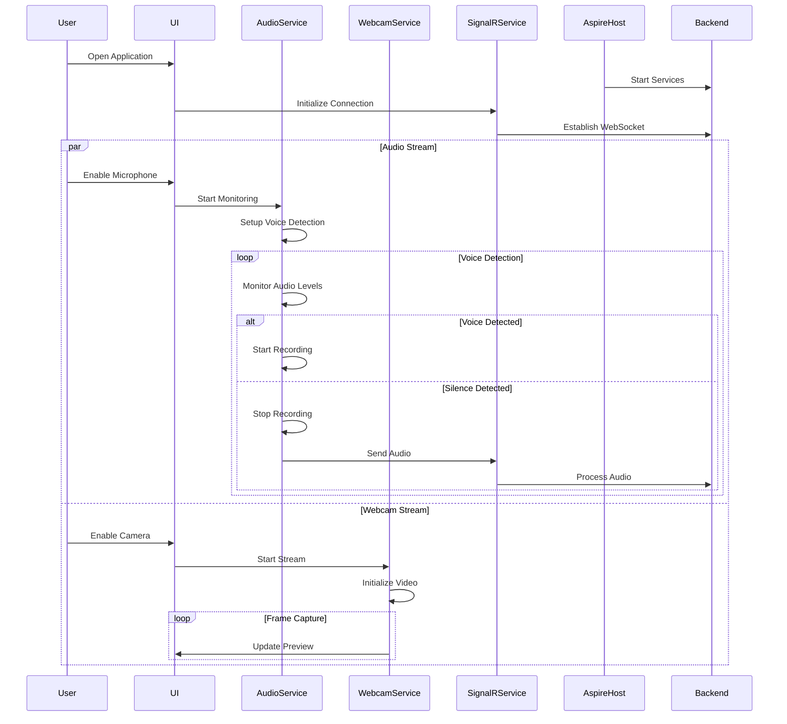
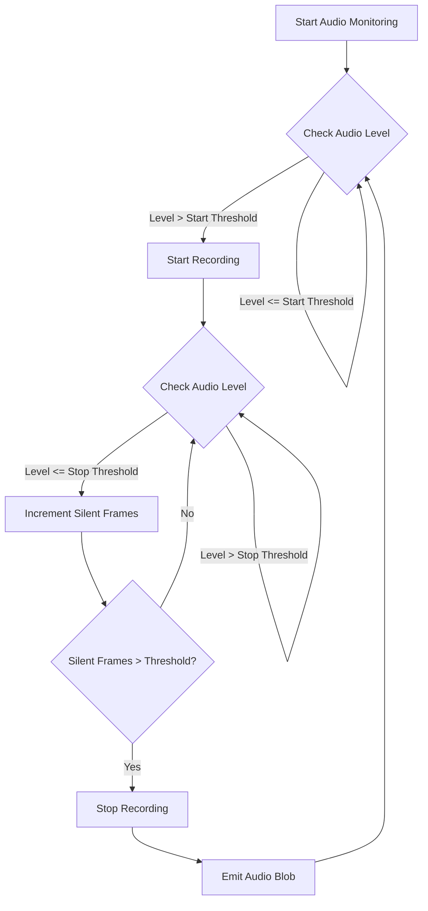
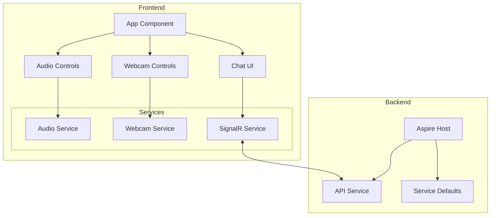
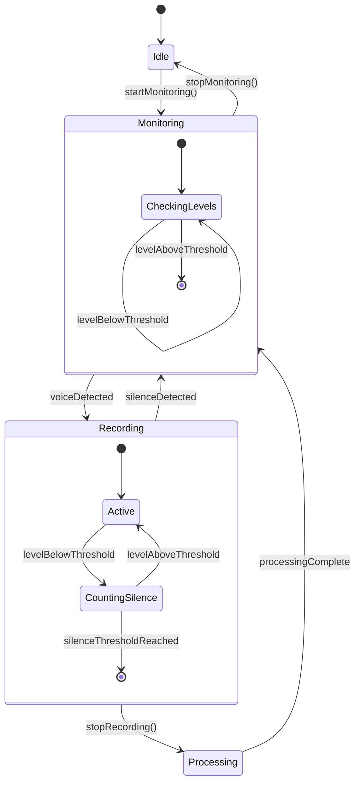
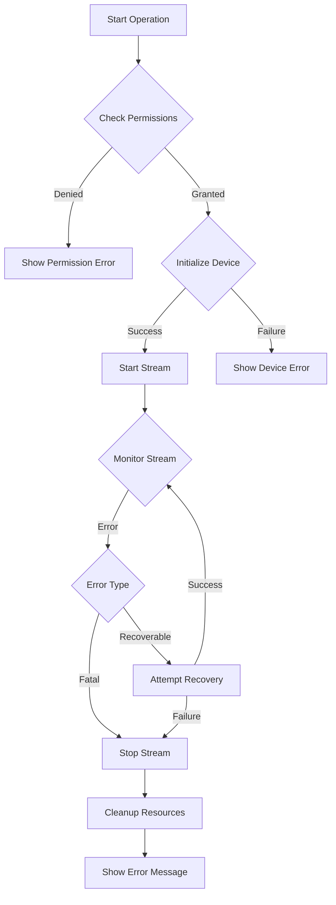

# Desktop Companion Application

A modern Angular-based desktop companion application featuring voice-activated recording and webcam capabilities.

## Features

### Voice-Activated Audio Recording

- Automatic voice detection and recording
- Smart silence detection for auto-stopping
- Configurable audio thresholds:
  - Start threshold: 0.24 (24% volume)
  - Stop threshold: 0.15 (15% volume)
  - Silence timeout: 2000ms (2 seconds)
- Real-time audio level monitoring
- Support for multiple audio formats (webm, mp4, ogg, wav)
- Error handling for various microphone states

### Webcam Integration

- Live webcam preview
- Independent webcam stream management
- Support for different camera resolutions
- Proper resource cleanup and state management

### Technical Features

- Reactive state management using RxJS
- Independent audio and video stream handling
- Cleanup of media resources
- Comprehensive error handling and logging
- TypeScript type safety throughout

## Setup

### Prerequisites

- Node.js (v22 or higher)
- Angular CLI (v19)
- Tailwind CSS v4
- Modern browser with WebRTC support

### Running the application

```bash
dotnet user-secrets init

dotnet user-secrets set "OpenAI:ApiKey" "your-api-key-here"

cd [repository-name]

cd ServoSkull.Angular

npm install

cd ..

dotnet run --project ServoSkull.AppHost
```

## .NET Aspire Integration

The application uses .NET Aspire for cloud-ready distributed application development and orchestration.

### App Host Structure

```text
ServoSkull.AppHost/              # Aspire host application
├── Program.cs                   # Service orchestration
└── appsettings.json            # Host configuration

ServoSkull.ServiceDefaults/      # Shared service configurations
├── Extensions.cs               # Service collection extensions
└── OpenTelemetry.cs           # Telemetry configuration

ServoSkull.ApiService/          # Backend API service
└── Program.cs                 # API service entry point
```

### Development Workflow

1. **Start the Aspire Host**:

   ```bash
   dotnet run --project ServoSkull.AppHost
   ```

   This will:
   - Start the Aspire dashboard
   - Launch the API service
   - Configure service discovery
   - Initialize telemetry collection

2. **Access the Dashboard**:
   - Open the dashboard URL in your browser
   - Monitor service health
   - View logs and telemetry
   - Check service dependencies

3. **Development Mode**:

   ```bash
   # Run with hot reload
   dotnet watch run --project ServoSkull.AppHost
   
   # Run with detailed logging
   dotnet run --project ServoSkull.AppHost --verbose
   ```

### Production Deployment

For production deployment, Aspire provides:

- Container orchestration
- Environment-specific configurations
- Health check endpoints
- Metrics collection
- Distributed tracing

Configure production settings in `appsettings.Production.json`:

```json
{
  "Aspire": {
    "Telemetry": {
      "Endpoint": "your-telemetry-endpoint",
      "Protocol": "grpc"
    },
    "Resilience": {
      "CircuitBreaker": {
        "SamplingDuration": "00:00:10"
      }
    }
  }
}
```

### Monitoring and Debugging

- Access the Aspire dashboard for:
  - Service status and health
  - Log aggregation
  - Performance metrics
  - Dependency mapping
  - Configuration validation

- Integrated logging with structured data:

  ```csharp
  logger.LogInformation("Service {ServiceName} started", serviceName);
  ```

- Health check endpoints:

  ```bash
  curl http://localhost:18888/health
  ```

## Usage

### Audio Recording

The audio service (`AudioService`) provides voice-activated recording with the following features:

```typescript
// Start monitoring for voice activity
audioService.startMonitoring();

// Subscribe to recording state
audioService.monitorState$.subscribe(state => {
  console.log('Recording state:', state);
});

// Handle recorded audio
audioService.audioRecorded$.subscribe(blob => {
  // Handle the recorded audio blob
});

// Stop monitoring
audioService.stopMonitoring();
```

### Webcam

The webcam service (`WebcamService`) manages camera streams:

```typescript
// Start webcam stream
webcamService.startStream({
  width: 640,
  height: 480,
  facingMode: 'user'
});

// Check stream status
webcamService.isStreamActive$.subscribe(active => {
  console.log('Stream active:', active);
});

// Stop webcam
webcamService.stopStream();
```

## Configuration

### Audio Settings

```typescript
interface AudioConfig {
  sampleRate: number;      // Default: 16000
  channels: number;        // Default: 1
  startThreshold: number;  // Default: 0.24
  stopThreshold: number;   // Default: 0.15
  silenceThreshold: number; // Default: 2000ms
  smoothingTimeConstant: number; // Default: 0.8
}
```

### Webcam Settings

```typescript
interface WebcamConfig {
  width: number;          // Default: 640
  height: number;         // Default: 480
  facingMode: 'user' | 'environment'; // Default: 'user'
}
```

## System design

### Frontend Services

- `AudioService`: Handles voice detection and recording
- `WebcamService`: Manages webcam streams
- Both services follow Angular's dependency injection pattern

### State Management

- Uses RxJS BehaviorSubjects for state management
- Provides Observable streams for reactive updates
- Maintains clean separation of concerns

### Error Handling

- Comprehensive error handling for media devices
- Detailed logging for debugging
- User-friendly error messages

### Diagrams


```mermaid
sequenceDiagram
    participant User
    participant UI
    participant AudioService
    participant WebcamService
    participant SignalRService
    participant AspireHost
    participant Backend

    User->>UI: Open Application
    AspireHost->>Backend: Start Services
    UI->>SignalRService: Initialize Connection
    SignalRService->>Backend: Establish WebSocket

    par Audio Stream
        User->>UI: Enable Microphone
        UI->>AudioService: Start Monitoring
        AudioService->>AudioService: Setup Voice Detection
        loop Voice Detection
            AudioService->>AudioService: Monitor Audio Levels
            alt Voice Detected
                AudioService->>AudioService: Start Recording
            else Silence Detected
                AudioService->>AudioService: Stop Recording
                AudioService->>SignalRService: Send Audio
                SignalRService->>Backend: Process Audio
            end
        end
    and Webcam Stream
        User->>UI: Enable Camera
        UI->>WebcamService: Start Stream
        WebcamService->>WebcamService: Initialize Video
        loop Frame Capture
            WebcamService->>UI: Update Preview
        end
    end
```


```mermaid
flowchart TD
    A[Start Audio Monitoring] --> B{Check Audio Level}
    B -->|Level > Start Threshold| C[Start Recording]
    B -->|Level <= Start Threshold| B
    C --> D{Check Audio Level}
    D -->|Level > Stop Threshold| D
    D -->|Level <= Stop Threshold| E[Increment Silent Frames]
    E --> F{Silent Frames > Threshold?}
    F -->|No| D
    F -->|Yes| G[Stop Recording]
    G --> H[Emit Audio Blob]
    H --> B
```


```mermaid
graph TD
    subgraph Frontend
        A[App Component]
        B[Audio Controls]
        C[Webcam Controls]
        D[Chat UI]
        
        subgraph Services
            E[Audio Service]
            F[Webcam Service]
            G[SignalR Service]
        end
        
        A --> B & C & D
        B --> E
        C --> F
        D --> G
    end
    
    subgraph Backend
        H[Aspire Host]
        I[API Service]
        J[Service Defaults]
        
        H --> I
        H --> J
    end
    
    G <--> I
```


```mermaid
stateDiagram-v2
    [*] --> Idle
    Idle --> Monitoring: startMonitoring()
    Monitoring --> Recording: voiceDetected
    Recording --> Monitoring: silenceDetected
    Recording --> Processing: stopRecording()
    Processing --> Monitoring: processingComplete
    Monitoring --> Idle: stopMonitoring()
    
    state Monitoring {
        [*] --> CheckingLevels
        CheckingLevels --> CheckingLevels: levelBelowThreshold
        CheckingLevels --> [*]: levelAboveThreshold
    }
    
    state Recording {
        [*] --> Active
        Active --> CountingSilence: levelBelowThreshold
        CountingSilence --> Active: levelAboveThreshold
        CountingSilence --> [*]: silenceThresholdReached
    }
```


```mermaid
flowchart TD
    A[Start Operation] --> B{Check Permissions}
    B -->|Denied| C[Show Permission Error]
    B -->|Granted| D{Initialize Device}
    D -->|Success| E[Start Stream]
    D -->|Failure| F[Show Device Error]
    E --> G{Monitor Stream}
    G -->|Error| H{Error Type}
    H -->|Recoverable| I[Attempt Recovery]
    H -->|Fatal| J[Stop Stream]
    I -->|Success| G
    I -->|Failure| J
    J --> K[Cleanup Resources]
    K --> L[Show Error Message]
```

## Browser Support

- Chrome/Edge (recommended)
- Firefox
- Safari (limited support)

## Known Limitations

- Audio recording requires explicit user permission
- Webcam access requires HTTPS in production
- Some browsers may have limited codec support

## Contributing

Contributions are welcome! Please read our contributing guidelines and submit pull requests to our repository.

## License

MIT License - see [LICENSE](LICENSE) file for details.