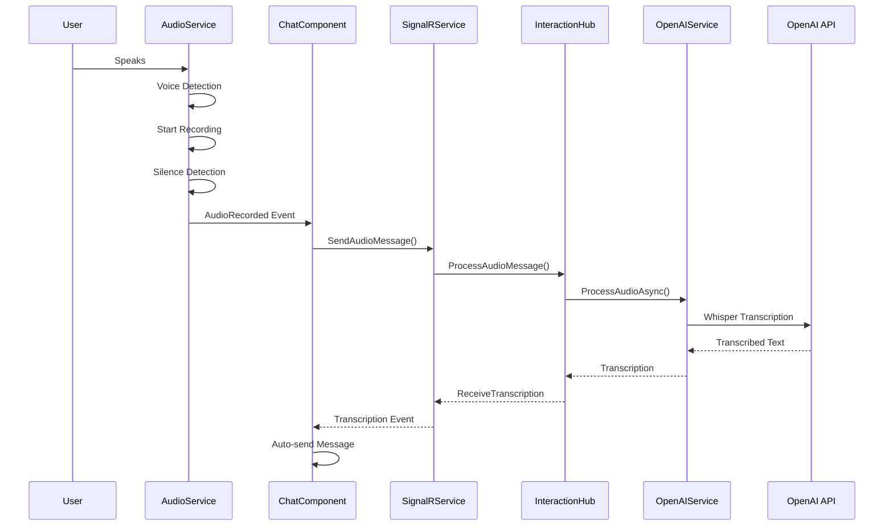
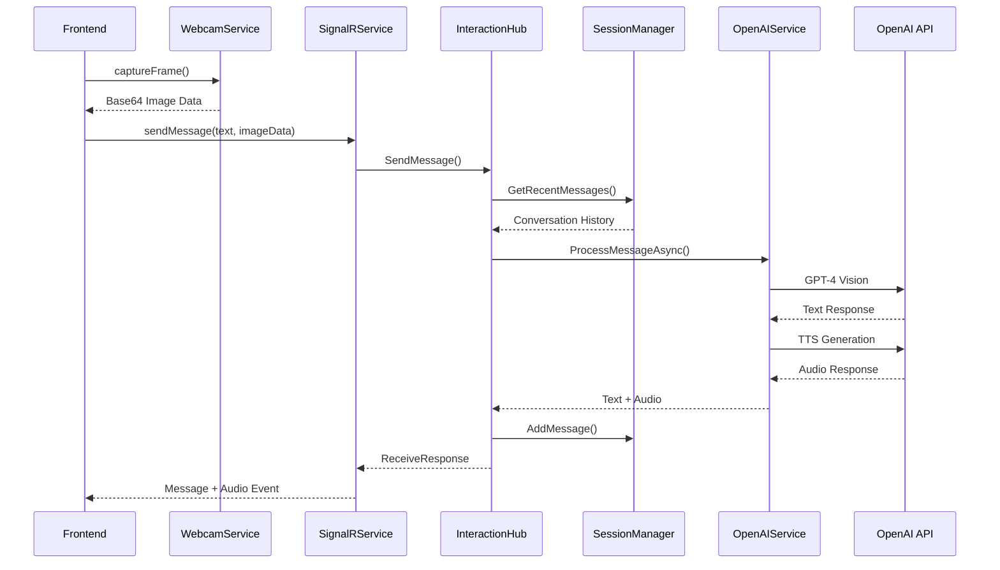

# ServoSkull Architecture Documentation

**Technical Deep-Dive into the Multimodal AI Desktop Companion**

---

## System Overview

ServoSkull implements a modern microservices architecture using .NET Aspire for orchestration, with a reactive Angular frontend and real-time SignalR communication. The system is designed for scalability, maintainability, and future robotics integration.

## High-Level Architecture

```
┌─────────────────────────────────────────────────────────────────┐
│                        Client Layer                             │
├─────────────────────────────────────────────────────────────────┤
│  Angular 19 Frontend (ServoSkull.Angular)                      │
│  ├── WebRTC Audio/Video Services                               │
│  ├── SignalR Real-time Communication                           │
│  ├── Reactive State Management (RxJS)                          │
│  └── Responsive UI (Tailwind CSS)                              │
└─────────────────────────────────────────────────────────────────┘
                                │
                          SignalR WebSocket
                                │
┌─────────────────────────────────────────────────────────────────┐
│                    Application Layer                            │
├─────────────────────────────────────────────────────────────────┤
│  API Service (ServoSkull.ApiService)                           │
│  ├── InteractionHub (SignalR Hub)                              │
│  ├── Multimodal Request Processing                             │
│  ├── Session Management                                        │
│  └── Error Handling & Logging                                  │
└─────────────────────────────────────────────────────────────────┘
                                │
                         Service Interfaces
                                │
┌─────────────────────────────────────────────────────────────────┐
│                     Service Layer                              │
├─────────────────────────────────────────────────────────────────┤
│  Core Services (ServoSkull.Infrastructure)                     │
│  ├── OpenAI Service (IAIService)                               │
│  ├── Session Manager (ISessionManager)                         │
│  ├── OpenAI Client (IOpenAIClient)                             │
│  └── Configuration Management                                  │
└─────────────────────────────────────────────────────────────────┘
                                │
                           HTTP/gRPC
                                │
┌─────────────────────────────────────────────────────────────────┐
│                    External Services                           │
├─────────────────────────────────────────────────────────────────┤
│  OpenAI APIs                                                   │
│  ├── GPT-4 (Text Generation)                                   │
│  ├── Whisper (Speech-to-Text)                                  │
│  └── TTS (Text-to-Speech)                                      │
└─────────────────────────────────────────────────────────────────┘
```

## Core Components

### 1. Aspire App Host (ServoSkull.AppHost)

**Purpose**: Orchestrates and manages all microservices

```csharp
// Program.cs - Service orchestration
var apiService = builder.AddProject<Projects.ServoSkull_ApiService>("apiservice");
var webApp = builder.AddProject<Projects.ServoSkull_Web>("webapp")
    .WithReference(apiService);

// Development: Angular with npm
var angularApp = builder.AddNpmApp("angular", "../ServoSkull.Angular")
    .WithReference(apiService)
    .WithHttpEndpoint(env: "PORT");

// Production: Angular container
var angularContainerApp = builder.AddContainer("angular", "servoskull-angular")
    .WithReference(apiService);
```

**Key Features**:
- **Environment-aware configuration**: Different setups for development/production
- **Service discovery**: Automatic endpoint resolution between services
- **Health monitoring**: Built-in health checks and telemetry
- **Resource management**: Proper startup ordering and dependencies

### 2. Angular Frontend (ServoSkull.Angular)

**Architecture Pattern**: Feature-based modules with shared services

```
src/
├── app/
│   ├── core/
│   │   ├── services/          # Singleton services
│   │   │   ├── audio.service.ts
│   │   │   ├── signalr.service.ts
│   │   │   └── webcam.service.ts
│   │   └── layout/            # Application shell
│   ├── features/
│   │   ├── chat/              # Chat feature module
│   │   └── home/              # Home feature module
│   └── shared/
│       └── components/        # Reusable components
```

#### Core Services Architecture

**AudioService** - Voice Processing
```typescript
interface AudioMonitorState {
  isMonitoring: boolean;    // Audio analysis active
  isRecording: boolean;     // Currently recording
  voiceDetected: boolean;   // Voice detected
  audioLevel: number;       // Current volume (0-1)
}

// Reactive state management
private monitorState = new BehaviorSubject<AudioMonitorState>();
public monitorState$ = this.monitorState.asObservable();
```

**SignalRService** - Real-time Communication
```typescript
// Hub connection with automatic reconnection
private hubConnection = new HubConnectionBuilder()
  .withUrl('/interactionHub')
  .withAutomaticReconnect()
  .build();

// Event-driven message handling
public onMessageReceived(): Observable<ChatMessage> {
  return this.messageReceived.asObservable();
}
```

**WebcamService** - Computer Vision
```typescript
// Stream management with resource cleanup
public async captureFrame(): Promise<string | null> {
  // Primary: Modern ImageCapture API
  const imageCapture = new ImageCapture(videoTrack);
  const blob = await imageCapture.takePhoto();
  return await this.blobToBase64(blob);
}
```

### 3. API Service (ServoSkull.ApiService)

**Core Component**: InteractionHub (SignalR Hub)

```csharp
public class InteractionHub : Hub
{
    // Multimodal message processing
    public async Task SendMessage(string message, string? imageData)
    {
        var request = new MultimodalRequest
        {
            Transcript = message,
            ImageData = imageData ?? string.Empty,
            PreviousContext = JsonSerializer.Serialize(recentMessages)
        };

        var textResponse = await _aiService.ProcessMessageAsync(request);
        var audioResponse = await _aiService.GenerateSpeechAsync(textResponse);
        
        await Clients.Caller.SendAsync("ReceiveResponse", textResponse, audioResponse);
    }

    // Audio-only processing
    public async Task ProcessAudioMessage(string base64Audio)
    {
        var response = await _aiService.ProcessAudioAsync(base64Audio);
        await Clients.Caller.SendAsync("ReceiveTranscription", response);
    }
}
```

### 4. Service Layer (ServoSkull.Infrastructure)

**Clean Architecture Implementation**

```csharp
// Abstraction (ServoSkull.Core)
public interface IAIService
{
    Task<string> ProcessMessageAsync(MultimodalRequest request);
    Task<string?> ProcessAudioAsync(string base64AudioString);
    Task<string> GenerateSpeechAsync(string text);
}

// Implementation (ServoSkull.Infrastructure)
public class OpenAIService : IAIService
{
    private readonly IOpenAIClient _openAIClient;
    private readonly OpenAIOptions _options;
    
    // Enhanced request with system prompt and context
    public async Task<string> ProcessMessageAsync(MultimodalRequest request)
    {
        var enhancedRequest = new MultimodalRequest
        {
            Transcript = request.Transcript,
            ImageData = request.ImageData,
            PreviousContext = string.IsNullOrEmpty(request.PreviousContext)
                ? _options.SystemPrompt
                : $"{_options.SystemPrompt}\n\nConversation history:\n{request.PreviousContext}"
        };
        
        return await _openAIClient.ProcessMultimodalRequestAsync(enhancedRequest);
    }
}
```

## Data Flow Architecture

### 1. Voice Interaction Flow



### 2. Multimodal Message Flow



## State Management

### Frontend State (RxJS Reactive Patterns)

```typescript
// Audio Service State
interface AudioMonitorState {
  isMonitoring: boolean;
  isRecording: boolean;
  voiceDetected: boolean;
  audioLevel: number;
}

interface AudioPlaybackState {
  isPlaying: boolean;
  duration: number;
  currentTime: number;
}

// Webcam Service State  
interface WebcamState {
  isStreamActive: boolean;
  hasPermission: boolean;
  error: string | null;
}

// SignalR Service State
interface ConnectionState {
  isConnected: boolean;
  connectionId: string | null;
  lastError: string | null;
}
```

### Backend State (Session Management)

```csharp
public class ConversationSession
{
    public string Id { get; } = Guid.NewGuid().ToString();
    public DateTimeOffset CreatedAt { get; } = DateTimeOffset.UtcNow;
    public DateTimeOffset LastActivityAt { get; private set; }
    public List<ConversationMessage> Messages { get; } = new();
    
    public void AddMessage(string role, string content, string? imageData = null)
    {
        Messages.Add(new ConversationMessage
        {
            Role = role,
            Content = content,
            ImageData = imageData,
            Timestamp = DateTimeOffset.UtcNow
        });
        LastActivityAt = DateTimeOffset.UtcNow;
    }
}
```

## Error Handling Strategy

### Frontend Error Boundaries

```typescript
// Service-level error handling
private handleAudioError(error: any): void {
  const errorState = this.getErrorState(error);
  this.monitorState.next({
    ...this.monitorState.value,
    error: errorState
  });
  
  // Attempt recovery for recoverable errors
  if (errorState.recoverable) {
    this.attemptRecovery();
  }
}

// Component-level error handling
async handleAudioPlayback(message: ChatMessage): Promise<void> {
  try {
    await this.audioService.playAudio(message.audioData!);
  } catch (error) {
    console.error('Error handling audio playback:', error);
    this.currentlyPlayingMessage = null;
    this.isAudioPlaying = false;
    this.cdr.markForCheck();
  }
}
```

### Backend Error Handling

```csharp
public async Task SendMessage(string message, string? imageData)
{
    try
    {
        // Processing logic...
    }
    catch (Exception ex)
    {
        _logger.LogError(ex, "Error processing message");
        await SendErrorAsync("MESSAGE_PROCESSING_FAILED", 
            "Failed to process message", ex.Message);
    }
}

private async Task SendErrorAsync(string code, string message, string? details = null)
{
    var error = new ErrorResponse
    {
        Code = code,
        Message = message,
        Details = details
    };
    
    await Clients.Caller.SendAsync("ReceiveError", error);
}
```

## Performance Optimizations

### Frontend Optimizations

1. **Change Detection Strategy**: OnPush for all components
2. **Resource Management**: Proper cleanup of WebRTC streams
3. **State Management**: Reactive observables with takeUntil pattern
4. **Bundle Optimization**: Lazy-loaded feature modules

### Backend Optimizations

1. **Connection Pooling**: HTTP client reuse for OpenAI API calls
2. **Session Management**: In-memory session storage with cleanup
3. **Logging**: Structured logging with appropriate levels
4. **Caching**: Future implementation for response caching

## Security Considerations

### API Security
- **Secret Management**: User secrets for API keys in development
- **Environment Variables**: Secure configuration in production
- **CORS Configuration**: Restricted cross-origin policies

### Data Privacy
- **Local Processing**: Audio/video processing in browser
- **Secure Transmission**: HTTPS/WSS for all communications
- **No Persistent Storage**: Session data cleared on disconnect

## Deployment Architecture

### Development
```yaml
Services:
  - ServoSkull.AppHost (Orchestrator)
  - ServoSkull.ApiService (Backend API)
  - ServoSkull.Angular (Frontend - npm dev server)
  
Monitoring:
  - Aspire Dashboard (http://localhost:18888)
  - Development tools and hot reload
```

### Production
```yaml
Services:
  - ServoSkull.AppHost (Orchestrator)
  - ServoSkull.ApiService (Backend API Container)  
  - ServoSkull.Angular (Frontend Container)
  
Infrastructure:
  - Container orchestration
  - Load balancing
  - Health monitoring
  - Distributed logging
```

## Future Architecture Considerations

### Robotics Integration
- **Hardware Abstraction Layer**: Interface for servo motor control
- **Spatial Awareness**: Integration with computer vision for movement decisions
- **Safety Systems**: Collision detection and movement constraints
- **Real-time Control**: Low-latency command processing for physical actions

### Scalability Enhancements
- **Horizontal Scaling**: Load balancer for multiple API instances
- **Message Queuing**: Async processing for heavy AI operations  
- **Caching Layer**: Redis for session and response caching
- **CDN Integration**: Static asset delivery optimization

---

*This architecture document reflects the current implementation and provides a foundation for future enhancements toward full robotics integration.*